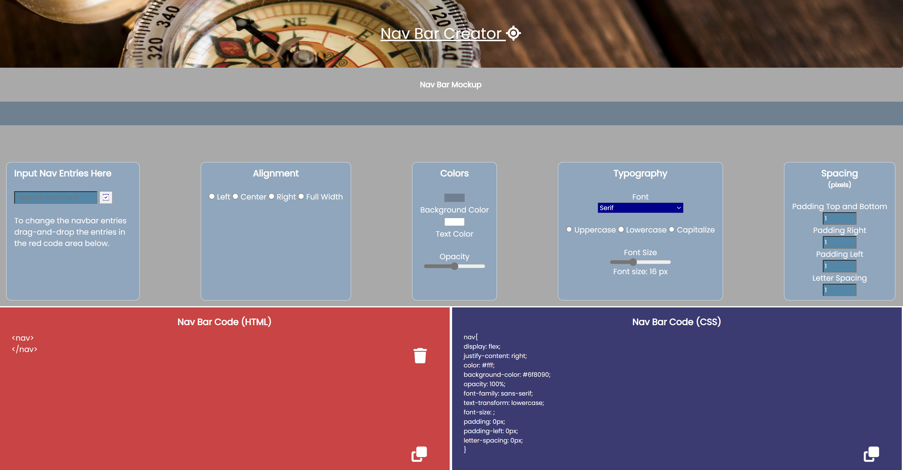

# Javascript Navbar creator

A one page front end app for creating and modifying html and css code for navigation bars. The app allows the user to input the names he wants into the input field and the page will automatically display a mockup of the future navigation bar at the top of the screen. In the middle of the screen is a user dashboard which allows for common navbar modifications: alignment (center,left,right and full-width), color (text and background), opacity, font size, font family, text case, padding and letter spacing.

At the bottom of the screen are two areas for the html and css code generated by the dashboard.As each style is altered by sliders, drop-down menus or rockers, the code is automatically generated and updated. When the user is happy that the navbar looks the way they want, then they click on the copy button at the bottom right of each code area and the code is copied to their clipboard.

The navbar entries are also modified from the code area by dragging entries either to the trashcan where they are deleted from both the code area and mockup area, or by dragging navbar entries over one another in the list, where they will swap places.

The app does not cover all possible modifications available for a navbar and there is room for expansion, such as options for hamburger style menus or for outliers to the right or left while the rest of the navbar remains on the opposing side and for different unit measurements than pixels. 

The app is not very responsive, because a navbar is something you design on a desktop rather than a mobile device.

 

The app has been checked through HTML, CSS and Javascript linters.
